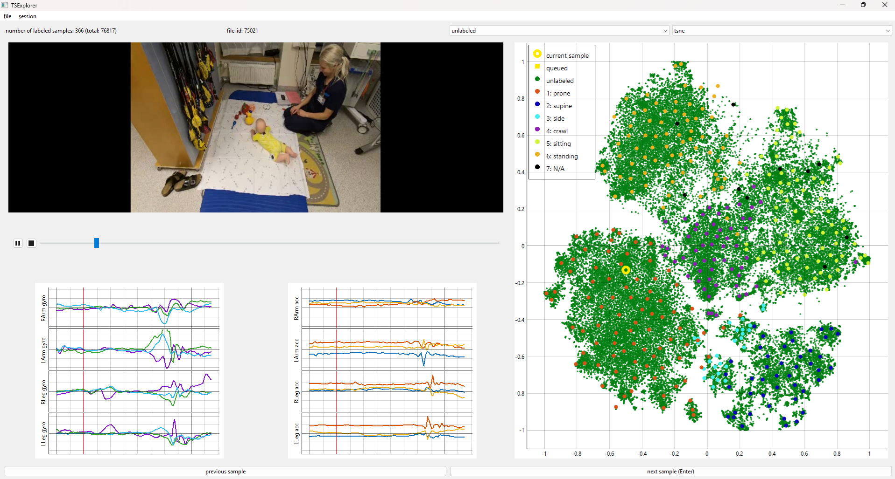
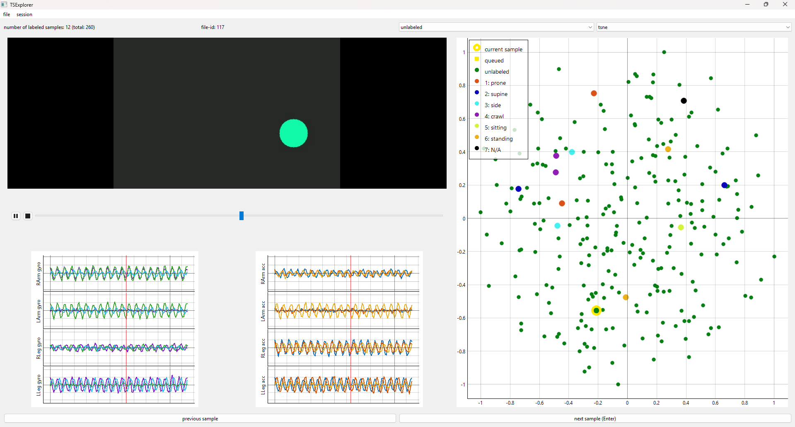
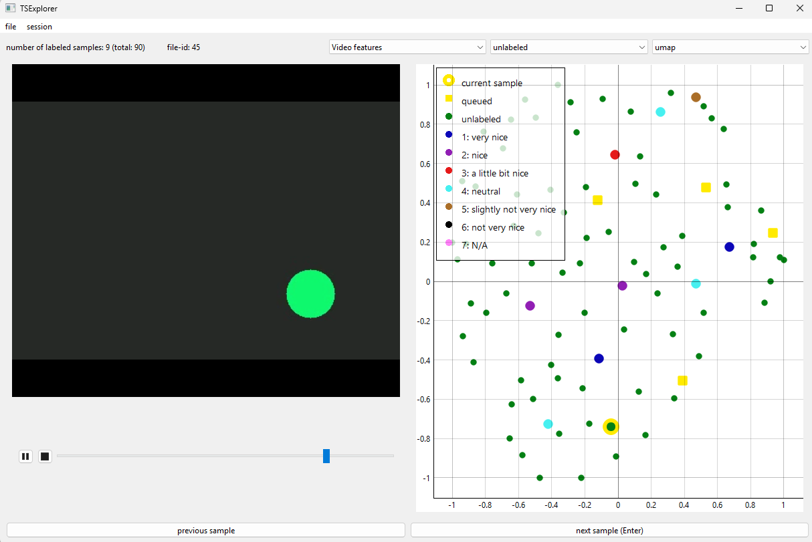
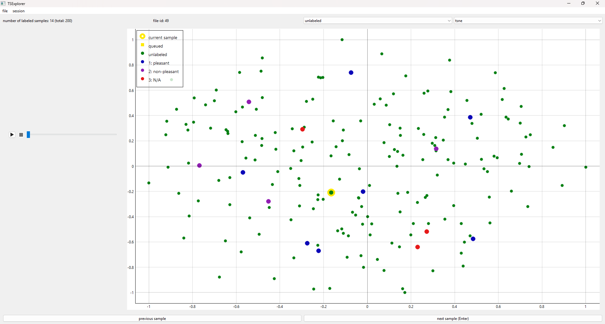
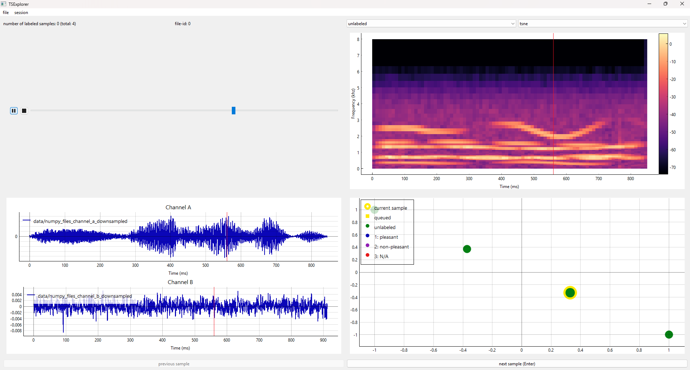
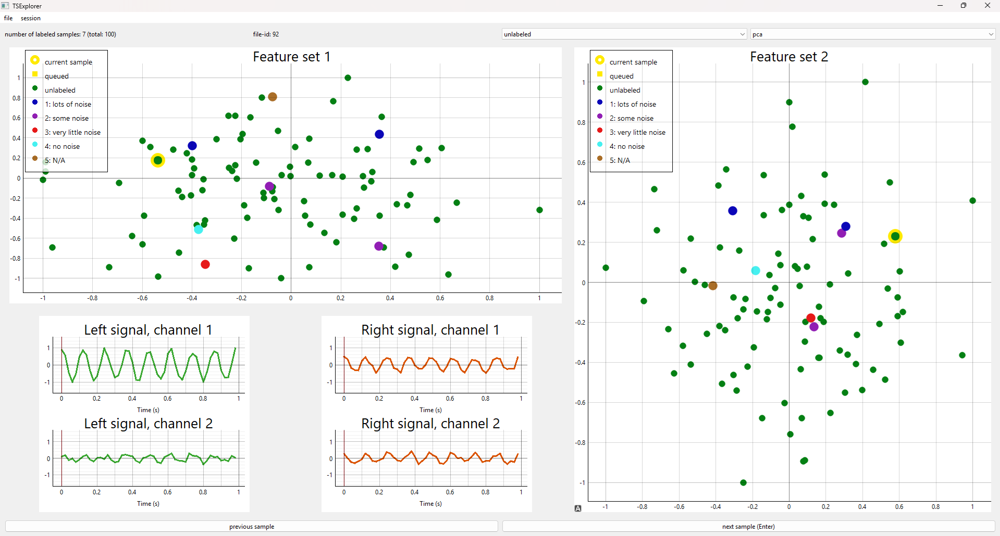

# TSExplorer: An interactive data annotation and visualization tool for time-series data

This repository contains a graphical user interface (GUI)-based interactive data annotation and visualization tool for time-series data called **Time-Series Explorer (TSExplorer)**. TSExplorer visualizes the entire dataset as a 2D scatter plot and allows annotators to freely explore complementary 2D representations of the underlying high-dimensional data. The code is partially implemented using the official PySide bindings for Qt6.

TSExplorer has been used in the following publication (**NOTE: arXiv pre-print only, publication venue not yet confirmed**):
[E. Vaaras, M. Airaksinen, and O. Räsänen, "Evaluating Interactive 2D Visualization as a Sample Selection Strategy for Biomedical Time-Series Data Annotation", _(arXiv pre-print, publication venue will be updated here later)_](https://arxiv.org/abs/2603.26592).

If you use the present code or its derivatives, please cite the [repository URL](https://github.com/SPEECHCOG/TSExplorer) and/or the [aforementioned publication](https://arxiv.org/abs/2603.26592).

<ins>**Please note**</ins> that, while some features will still be added to TSExplorer, the code is not under constant maintenance. If you encounter any issues with the code or would like to request additional features, please contact [Einari Vaaras](https://www.tuni.fi/en/people/einari-vaaras).


|  |
|:--:|
| *Figure 1: An example screenshot of TSExplorer (from [Vaaras et al. (2026)](https://arxiv.org/abs/2603.26592)).* |


## Installation
The application should work on Windows, Linux, and MacOS, with Python versions 3.8.X - 3.10.X supported (version 3.9 recommended, as that version has been used for the majority of TSExplorer's development process).

Step-by-step installation instructions (__Anaconda recommended__):
  1. Either clone the repository (https://github.com/SPEECHCOG/TSExplorer.git) or download and extract the ZIP package of the repository (https://github.com/SPEECHCOG/TSExplorer --> _Code_ --> _Download ZIP_)
  2. Open a terminal (PowerShell, Anaconda Prompt, Command Prompt etc. in Windows) and change the current directory to the TSExplorer directory using the command `cd path_of_tsexplorer`, where _path_of_tsexplorer_ is the directory where TSExplorer is located.
  3. (_Optional for Anaconda users_) In a terminal where Conda is available, create a Conda environment where you will install TSExplorer by running the command `conda create -n tsexplorer_env python=3.9`, where _tsexplorer_env_ is the name of the Conda environment.
  4. (_Optional for Anaconda users_) In a terminal where Conda is available, activate the Conda environment by running the command `conda activate tsexplorer_env`, where _tsexplorer_env_ is the name of the Conda environment.
  5. Install TSExplorer using the command `pip install .` (note the period "." **which belongs** to the command).
  6. Verify that the installation succeeded using the command `tsexplorer --version`. After a successful installation, this command should print the current version of TSExplorer to the command line.

For cross-platform compatibility, TSExplorer uses _VLC Media Player_ to play audio and video. With VLC, common media player functions like play, pause, stop, and scrolling function normally. **If you need to use audio or video playback** with TSExplorer, you need to [install VLC](https://www.videolan.org/vlc/) before proceeding to use TSExplorer. Note that all the usage examples below require audio or video playback, i.e. installing VLC is required.


## Examples of how to use TSExplorer

You can either use the command
```
tsexplorer
```
or
```
tsexplorer --config-file <name_of_yml_configuration_file>
```
in order to run TSExplorer. Using the former of these options requires having a configuration file named _user_config.yml_ in the same directory as TSExplorer (this file is already provided together with the package). In the latter option, _<name_of_yml_configuration_file>_ is a _.yml_ configuration file containing the settings you want to use with TSExplorer. By default, the configuration file _user_config.yml_ uses the a simulated dataset of multi-sensor inertial measurement unit (IMU) data.

### Demo of multi-sensor IMU data with video

|  |
|:--:|
| *Figure 2: An example screenshot of TSExplorer during the multi-sensor IMU data demo.* |

You can either use the command
```
tsexplorer
```
or
```
tsexplorer --config-file user_config.yml
```
in order to run a demo example of TSExplorer with randomly-generated multi-sensor IMU data (see Figure 2). This demo simulates the case of Figure 1, and it shows:
  * Randomly-generated data of four IMU sensors (one in each limb), each recording both tri-axial gyroscope and accelerometer data.
  * A scatter plot visualizing randomly-generated 160-dimensional data in 2D. Each sample corresponds to approximately 2.3 seconds of IMU data.
  * A video widget (showing a randomly-generated sequence of a circle bouncing around).

This demo contains a 5-minute sequence of simulated IMU data (sampling rate of 52 Hz), split into 120-sample frames (approximately 2.3 seconds each) with an overlap of 50% (60 samples). This leads to a demo dataset of 260 frames (samples) altogether.

When letting TSExplorer select samples for you (i.e. either pressing the "next sample" button or the _Enter_ key), this demo uses the farthest-first traversal (FAFT) algorithm. In the demo, the FAFT indices have been computed from the 2D t-SNE features using the Euclidean distance.

Except for the MP4 video, all the data is stored into _.npy_ data matrices. See the configuration file _user_config.yml_ for further details.


### Demo of multimodal features

|  |
|:--:|
| *Figure 3: An example screenshot of TSExplorer during the multimodal feature demo.* |

You can use the command
```
tsexplorer --config-file user_config_multimodal.yml
```
in order to run a demo example of TSExplorer with randomly-generated multimodal features (Figure 3). This demo simulates annotating video data with separate 2D visualizations for "audio", "video", and combined "audio + video" features. The demo shows:
  * A scatter plot visualizing either randomly-generated 32-dimensional audio features, 16-dimensional video features, or combined 48-dimensional "audio + video" features in 2D. Each sample corresponds to a video clip of approximately 2.3 seconds.
  * A drop-down menu enabling switching between audio, video, and combined "audio + video" features.
  * A video widget (showing a randomly-generated sequence of a circle bouncing around).

This demo contains a dataset of 90 randomly-generated samples, each corresponding to a video clip of approximately 2.3 seconds. The purpose of the demo is to exemplify the use of TSExplorer with multimodal features, as 2D visualizations of different features and their combinations may highlight different aspects of the data. When letting TSExplorer select samples for you (i.e. either pressing the "next sample" button or the _Enter_ key), this demo uses random sampling, i.e. the next sample is selected at random.

**Note that** the demo demonstrates the use of an ID mapping file _data/id_mapping_simulated_data_multimodal.npy_ that is used together with the video file. This file contains a list of integers that map the sample indices used by TSExplorer to the corresponding clip indices in the original video. This is useful when your data arrays and your video do not cover the same time span. For example, imagine you have:
  * A 10‑minute video
  * Non-overlapping 1‑second clips --> 600 video clips in total
  * A 2‑minute segment in the middle that you want to discard
  * Only the first 4 minutes (240 clips) and last 4 minutes (240 clips) should be used --> 480 usable samples

Your data arrays in TSExplorer may therefore contain **480 samples**, even though the video still contains **600 clips**. The ID mapping file allows you to keep the original video intact while still skipping the unwanted portion, as it tells TSExplorer which video clip each of the 480 samples corresponds to. For example, the mapping file would conceptually look like `[0, 1, 2, ..., 239, 360, 361, ..., 599]`. This way:
  * Samples 0–239 map to the first 240 seconds of the video
  * Samples 240–479 map to the last 240 seconds of the video
  * The middle 120 clips (indices 240–359) are simply never used

TSExplorer can then visualize the correct corresponding video frames without requiring the user to modify or trim the video file itself.

**Also note that**, for demonstration purposes, this demo does not use pre-computed _.npy_ files for the 2D visualizations. Instead, it computes the t-SNE, PCA, and UMAP 2D visualizations "on-the-fly":
  1. When first using a given visualization algorithm (t-SNE/PCA/UMAP) for a given set of features, TSExplorer computes the 2D visualization and saves it as a _.npy_ file.
  2. Later on, if TSExplorer needs to use the same visualization algorithm for the same set of features, it loads the pre-computed _.npy_ file.

This approach is fine with smaller datasets, but with larger datasets it is **highly recommended** to pre-compute the t-SNE, PCA, and UMAP 2D visualizations before running TSExplorer to reduce computational overhead (see the _data_ directory regarding file naming conventions).

Except for the MP4 video, all the data is stored into _.npy_ data matrices. See the configuration file _user_config_multimodal.yml_ for further details.


### Demo 1 of audio data (audio data in a single _.npy_ file)

|  |
|:--:|
| *Figure 4: An example screenshot of TSExplorer during the first audio data demo (Demo 1 of audio data).* |

You can use the command
```
tsexplorer --config-file user_config_audio.yml
```
in order to run a demo example of TSExplorer with randomly-generated audio data (Figure 4). This demo simulates annotating audio data, and it shows:
  * A scatter plot visualizing randomly-generated 128-dimensional data in 2D. Each sample corresponds to an audio sample with a duration varying between 0.5 and 1.0 seconds.
  * An audio widget (playing randomly-generated audio samples).

This demo contains a dataset of 200 randomly-generated audio samples with a duration varying between 0.5 and 1.0 seconds. When letting TSExplorer select samples for you (i.e. either pressing the "next sample" button or the _Enter_ key), this demo uses random sampling, i.e. the next sample is selected at random. The audio WAV files are stored into a single _.npy_ object file, and the rest of the data are stored into _.npy_ data matrices. See the configuration file _user_config_audio.yml_ for further details.


### Demo 2 of audio data (audio data as separate _.wav_ files)

|  |
|:--:|
| *Figure 5: An example screenshot of TSExplorer during the second audio data demo (Demo 2 of audio data).* |

You can use the command
```
tsexplorer --config-file user_config_audio_separate_files.yml
```
in order to run a demo example of TSExplorer with randomly-generated audio data (Figure 5). This demo contains a small subset (four samples) of the 200-sample audio described above in _Demo 1 of audio data_. This time, the audio data are stored as separate _.wav_ files in a separate folder. The demo shows:
  * A scatter plot visualizing randomly-generated 128-dimensional data in 2D, each sample corresponding to an audio file with a duration between 0.5 and 1.0 seconds.
  * A visualization of two-channel audio data. Note that in the demo, the visualization for "Channel A" displays the actual sample, whereas the visualization for "Channel B" contains a random audio sample. These channel-wise samples are stored as separate _.npy_ files in separate folders.
  * A log-mel visualization of audio data. In the demo, this is a visualization for the actual audio sample, i.e. the sample shown in the "Channel A" visualization. The log-mel features are stored as separate _.npy_ files in a separate folder.
  * An audio widget (playing randomly-generated audio sample from "Channel A").

When letting TSExplorer select samples for you (i.e. either pressing the "next sample" button or the _Enter_ key), this demo uses the ordered selector, i.e. the next sample is selected from the ordered list based on the file names/indices. See the configuration file _user_config_audio_separate_files.yml_ for further details.

**Note that** when using TSExplorer with separate files in some given folder, the sample indices created by TSExplorer correspond to the lexicographical order of the file names. This means that e.g. if we have two files named _11_sample.wav_ and _2_sample.wav_, the file _11_sample.wav_ will have index 0 and the other file _2_sample.wav_ will have index 1.

**Also note that**, for demonstration purposes, this demo does not use pre-computed _.npy_ files for the 2D visualizations. Instead, it computes the t-SNE, PCA, and UMAP 2D visualizations "on-the-fly":
  1. When first using a given visualization algorithm (t-SNE/PCA/UMAP), TSExplorer computes the 2D visualization and saves it as a _.npy_ file.
  2. Later on, if TSExplorer needs to use the same visualization algorithm, it loads the pre-computed _.npy_ file.

This approach is fine with smaller datasets, but with larger datasets it is **highly recommended** to pre-compute the t-SNE, PCA, and UMAP 2D visualizations before running TSExplorer to reduce computational overhead (see the _data_ directory regarding file naming conventions).


### Demo of multiple scatter plots

|  |
|:--:|
| *Figure 6: An example screenshot of TSExplorer during the demo of multiple scatter plots.* |

You can use the command
```
tsexplorer --config-file user_config_multiscatter.yml
```
in order to run a demo example of TSExplorer with multiple scatter plots (Figure 6). This demo simulates annotating signal data while visualizing two distinct sets of features in 2D simultaneously, and it shows:
  * Randomly-generated 1-second samples of imaginary 2-channel "left" and "right" signals with a 50-Hz sampling rate.
  * Two scatter plots visualizing randomly-generated 8-dimensional and 10-dimensional data in 2D. Each sample corresponds to the 1-second signal samples.

This demo contains 100 signal samples altogether. When letting TSExplorer select samples for you (i.e. either pressing the "next sample" button or the _Enter_ key), this demo uses the ordered selector, i.e. the next sample is selected from the ordered list based on the file names/indices. See the configuration file _user_config_multiscatter.yml_ for further details.

**Note that**, for demonstration purposes, this demo does not use pre-computed _.npy_ files for the 2D visualizations. Instead, it computes the t-SNE, PCA, and UMAP 2D visualizations "on-the-fly":
  1. When first using a given visualization algorithm (t-SNE/PCA/UMAP), TSExplorer computes the 2D visualization and saves it as a _.npy_ file.
  2. Later on, if TSExplorer needs to use the same visualization algorithm, it loads the pre-computed _.npy_ file.

This approach is fine with smaller datasets, but with larger datasets it is **highly recommended** to pre-compute the t-SNE, PCA, and UMAP 2D visualizations before running TSExplorer to reduce computational overhead (see the _data_ directory regarding file naming conventions).


## TSExplorer user manual

**Note: A list of TSExplorer properties and how to use TSExplorer will be added to this repository soon!**


## Uninstalling TSExplorer

### Anaconda users

Anaconda users can uninstall TSExplorer using the following commands:
  1. `conda deactivate` (if Conda environment is not deactivated yet)
  2. `conda remove --name tsexplorer_env --all` (given that the name of the Conda environment was _tsexplorer_env_)

### Non-Anaconda users

If you installed TSExplorer without Anaconda, you can uninstall it using the following command:
```
pip uninstall tsexplorer
```

